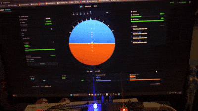
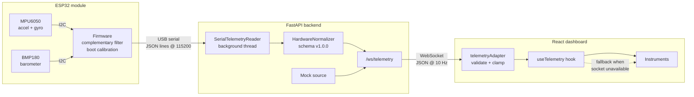

# Project Athena

A ground-station telemetry dashboard for a student-built UAV, spanning the full stack from sensor firmware to browser: **ESP32 sensor firmware → Python telemetry service → React instrument panel**.



*Hardware in the loop: rolling the ESP32 module by hand on the bench, with the artificial horizon following it live. The path from sensor to screen is MPU6050 → I²C → ESP32 → USB serial → FastAPI → WebSocket → React. Recorded off-screen with a phone, so the instrument text is not legible at this size.*

> **Project status — read this first.**
> The dashboard, the telemetry backend, and the ESP32 firmware are complete and work together end to end. **The airframe is not built yet.** All telemetry is therefore either (a) generated by a mock source for UI development, or (b) read live from a hand-held ESP32 sensor module over USB. There is no flight controller, no radio downlink, and no flying vehicle. The [Real vs. simulated](#real-vs-simulated) table below states exactly which number on the screen comes from a physical sensor and which does not.

---

## Contents

- [What this is](#what-this-is)
- [Architecture](#architecture)
- [Telemetry flow](#telemetry-flow)
- [Real vs. simulated](#real-vs-simulated)
- [Telemetry contract](#telemetry-contract)
- [Running locally](#running-locally)
- [Hardware](#hardware)
- [Configuration reference](#configuration-reference)
- [Repository layout](#repository-layout)
- [Roadmap](#roadmap)
- [License](#license)

---

## What this is

Project Athena is the ground-station half of a UAV project. The intent is that when the airframe exists, the same dashboard that today renders mock data will render real flight telemetry without changing the frontend — because everything crosses one versioned JSON contract.

The repository contains three cooperating pieces:

| Component | Stack | Role |
| --- | --- | --- |
| **Frontend** (`src/`) | React 19, TypeScript, Vite 7, Tailwind CSS, shadcn/ui | Artificial horizon, attitude/altitude instruments, health and power cards, live console |
| **Backend** (`backend/`) | Python 3, FastAPI, `uvicorn`, `pyserial` | Reads the ESP32 serial stream (or generates mock packets), normalizes both into one schema, broadcasts over WebSocket |
| **Firmware** (`firmware/`) | C++ / Arduino, ESP32 | Reads MPU6050 + BMP180 over I²C, self-calibrates on boot, emits one JSON line per sample at ~10 Hz over USB serial |

The design goal throughout was that **the dashboard should never silently lie about the quality of its data.** Estimated heading, relative altitude, missing battery sensing, and degraded serial links are all carried explicitly in the payload and surfaced in the UI rather than hidden behind a plausible-looking number.

## Architecture



Each boundary is deliberately narrow: the firmware knows nothing about WebSockets, the backend knows nothing about React, and the frontend accepts only payloads that pass validation.

## Telemetry flow

1. **Sense.** The ESP32 samples the MPU6050 and BMP180 over I²C. Roll and pitch come from a complementary filter (`α = 0.96`) blending gyro integration with the accelerometer vector; yaw is integrated from gyro-Z alone with a measured bias offset and a small deadband. Altitude is EMA-smoothed (`α = 0.22`).
2. **Calibrate.** For the first ~3.5 s after boot the firmware averages roll, pitch, and altitude to establish zero offsets and a home-altitude baseline, and zeroes yaw. It reports `calibration_status: "calibrating"` until this completes, so the dashboard can show the instruments as not-yet-trustworthy.
3. **Emit.** One `StaticJsonDocument` per cycle is serialized to USB serial at 115200 baud, ~10 Hz, newline-delimited.
4. **Ingest.** `SerialTelemetryReader` runs on a daemon thread, holds the latest packet behind a lock, and reconnects on a 2-second loop if the port drops. Malformed lines are skipped rather than crashing the stream.
5. **Normalize.** `HardwareNormalizer` maps raw firmware fields into schema `1.0.0`, derives vertical speed by differentiating altitude over wall-clock time (heavily smoothed at `α = 0.12`, because BMP180 altitude is noisy), and clamps every percentage into range. When no packet has arrived it emits an explicit `disconnected_payload` rather than stale values.
6. **Broadcast.** FastAPI pushes JSON frames over `/ws/telemetry` at `ATHENA_WS_HZ` (default 10 Hz).
7. **Validate.** `parseTelemetryPayload` on the frontend re-checks every field: shape, enum membership, finite numbers. A payload that drifts from contract returns `null` and is logged to the on-screen console as an error instead of being rendered.
8. **Render.** `useTelemetry` owns socket lifecycle, mode state, and reconnection. If the socket closes while in live mode it logs the drop and falls back to mock so the instruments keep moving — the source badge changes to make the fallback obvious.

## Real vs. simulated

This is a bench project. The table is exact.

| Signal | Source | Status |
| --- | --- | --- |
| Dashboard UI, instruments, console | — | ✅ Real, working |
| WebSocket transport + reconnection | — | ✅ Real |
| FastAPI service, `/health`, serial ingest | — | ✅ Real |
| Payload validation + normalization | — | ✅ Real |
| Roll / pitch | MPU6050 | ✅ Real sensor data |
| Altitude | BMP180 | ⚠️ Real, but **relative to boot baseline**, not AMSL |
| Vertical speed | BMP180 (differentiated) | ⚠️ Derived from barometric altitude; heavily smoothed |
| Temperature | BMP180 die sensor | ⚠️ Real, but sensor-die temperature, not ambient air |
| Heading / yaw | MPU6050 gyro-Z | ⚠️ Real gyro, **integrated → drifts.** No magnetometer, so this is not a compass |
| IMU quality | Derived from accel magnitude error vs 1 g | ✅ Real derived metric |
| Battery | — | ❌ **Not implemented.** No voltage divider is wired; firmware sends `null`, UI renders `N/A` |
| Signal strength | — | ❌ **Placeholder.** Hard-coded `100` in hardware mode — there is no radio link to measure |
| Flight mode | — | ❌ **Placeholder.** No flight controller; hardware mode always reports `STABILIZE` |
| Mock / simulation telemetry | Deterministic sine functions | ❌ Synthetic by design, for UI development |
| Airframe, motors, flight controller, RF downlink | — | ❌ **Not built.** Telemetry today travels over a USB cable |

Placeholder fields are transported as real schema fields on purpose: they keep the contract stable so that adding a voltage divider or a telemetry radio later is a firmware change, not a frontend rewrite.

## Telemetry contract

Every producer emits the same envelope (`schema_version: "1.0.0"`). Abbreviated:

```jsonc
{
  "schema_version": "1.0.0",
  "timestamp": "2026-04-15T20:03:06.412Z",
  "sequence": 1043,
  "vehicle": {
    "id": "ATHENA-HW-001",
    "connection": { "status": "connected", "signal_strength_pct": 100 },
    "flight":     { "mode": "STABILIZE", "system_status": "nominal" }
  },
  "attitude": { "roll_deg": 1.2, "pitch_deg": -3.4, "heading_deg": 57.8 },
  "altitude": { "relative_m": 0.3, "vertical_speed_mps": 0.02 },
  "power":    { "battery_pct": null },
  "health":   { "temperature_c": 28.9, "imu_quality_pct": 94.0 },

  // Provenance and honesty flags
  "telemetry_source": "hardware",   // frontend-mock | frontend-simulation | backend-mock | hardware
  "heading_is_estimated": true,
  "altitude_is_relative": true,
  "battery_available": false,
  "calibration_status": "ready",    // calibrating | ready | unknown
  "sensor_status": { "imu_ok": true, "baro_ok": true, "serial_connected": true }
}
```

`telemetry_source` is what lets the UI show where each frame actually came from, so a screenshot is never ambiguous about whether it was hardware or mock.

A contract regression test runs the committed sample payload through the real frontend adapter, so a schema change on either side fails fast:

```bash
npm run smoke:telemetry
```

Other checks:

```bash
npm run lint     # ESLint; vendored shadcn/ui primitives are excluded
npm run build    # type-check (tsc -b) then production bundle
```

## Running locally

Prerequisites: **Node.js 20+** and **Python 3.10+**. The ESP32 is optional — the first path below needs no hardware and no backend.

### 1. Dashboard only (fastest — no backend, no hardware)

The frontend generates its own telemetry when no socket is available, so this is enough to see the whole UI.

```bash
npm install
cp .env.example .env      # Windows: copy .env.example .env
npm run dev
```

Open the printed URL (default `http://127.0.0.1:5173`). Set `VITE_TELEMETRY_MODE=mock` in `.env` to skip the WebSocket attempt entirely.

### 2. Full stack with backend mock telemetry

**Terminal 1 — backend:**

```bash
cd backend
python -m venv .venv
source .venv/bin/activate          # Windows: .\.venv\Scripts\Activate.ps1
pip install -r requirements.txt
cp .env.example .env               # Windows: copy .env.example .env
uvicorn main:app --host 127.0.0.1 --port 8000 --reload
```

Verify: `curl http://127.0.0.1:8000/health` → `{"ok":true,"mode":"mock",...}`

**Terminal 2 — frontend:**

```bash
npm run dev
```

With `VITE_TELEMETRY_MODE=auto` (the default) the dashboard starts on mock telemetry, connects to the socket shortly after mount, and switches the source badge to `BACKEND-MOCK` once frames arrive.

> **Port note:** if `8000` is blocked on your machine, run the backend on another port (e.g. `--port 8765`) and set `VITE_WS_URL=ws://127.0.0.1:8765/ws/telemetry` in `.env`.

### 3. Hardware mode with the ESP32

See [Hardware](#hardware) for wiring and bring-up first. Once the board is streaming JSON:

```bash
cd backend
source .venv/bin/activate                        # Windows: .\.venv\Scripts\Activate.ps1
export ATHENA_TELEMETRY_MODE=hardware            # Windows: $env:ATHENA_TELEMETRY_MODE="hardware"
export ATHENA_SERIAL_PORT=/dev/ttyUSB0           # Windows: $env:ATHENA_SERIAL_PORT="COM3"
uvicorn main:app --host 127.0.0.1 --port 8000 --reload
```

Tilting the module should move the artificial horizon, and the source badge should read `HARDWARE`.

If the port is wrong or unavailable, the backend does **not** crash: it logs the error, keeps serving the socket, and emits a disconnected payload so the failure is visible in the UI.

## Hardware

### Bill of materials

| Part | Notes |
| --- | --- |
| ESP32 dev board | Any board exposing GPIO 21/22 |
| MPU6050 | 6-axis accel + gyro, I²C `0x68` |
| BMP180 | Barometric pressure + temperature, I²C `0x77` |

### Wiring

| Signal | ESP32 pin |
| --- | --- |
| `SDA` | GPIO 21 |
| `SCL` | GPIO 22 |
| `VCC` | 3V3 |
| `GND` | GND |

### Arduino libraries

`Adafruit MPU6050` · `Adafruit Unified Sensor` · `Adafruit BMP085 Library` (BMP180-compatible) · `ArduinoJson`

### Bring-up

1. Flash `firmware/esp32-athena-telemetry/tools/i2c_scanner/i2c_scanner.ino`.
2. Open the serial monitor at 115200 and confirm both `0x68` and `0x77` are detected. If addresses appear intermittently, check physical contact first — unsoldered headers are the usual cause.
3. Flash `firmware/esp32-athena-telemetry/esp32-athena-telemetry.ino`.
4. Keep the module flat and still for ~3.5 s while `calibration_status` moves `calibrating → ready`.
5. Confirm steady JSON lines, with roll/pitch near zero and altitude near `0.0` after calibration.
6. Start the backend in hardware mode.

To inspect the raw serial stream without running the backend:

```bash
python backend/tools/serial_reader_test.py --port /dev/ttyUSB0 --baud 115200
```

**Finding the port:** Windows — Device Manager → Ports (COM & LPT), watch which `COMx` appears when you plug the board in. macOS/Linux — `ls /dev/tty.usbserial-*` or `ls /dev/ttyUSB*`.

### Known sensor limitations

- **Yaw drifts.** The MPU6050 has no magnetometer, so heading is pure gyro integration. It is useful for showing motion; it is not a compass. The payload flags this with `heading_is_estimated: true`. A magnetometer (e.g. HMC5883L/QMC5883L) would be needed for true heading.
- **Altitude is relative.** BMP180 altitude depends on a sea-level pressure assumption and drifts with weather. The firmware reports delta from the boot baseline rather than implying a precise absolute altitude, flagged as `altitude_is_relative: true`.
- **No battery sensing.** Nothing is wired to measure pack voltage, so `battery_pct` is `null` and the UI shows `N/A` rather than inventing a value or raising a false low-battery alarm.

## Configuration reference

**Frontend** — `.env` (see `.env.example`)

| Variable | Default | Meaning |
| --- | --- | --- |
| `VITE_WS_URL` | `ws://127.0.0.1:8000/ws/telemetry` | Backend WebSocket endpoint |
| `VITE_TELEMETRY_MODE` | `auto` | `auto` (mock, then attempt live) · `live` · `mock` · `simulation` |

**Backend** — `backend/.env` (see `backend/.env.example`)

| Variable | Default | Meaning |
| --- | --- | --- |
| `ATHENA_TELEMETRY_MODE` | `mock` | `mock` or `hardware` |
| `ATHENA_SERIAL_PORT` | *(empty)* | e.g. `COM3`, `/dev/ttyUSB0`. Required in hardware mode |
| `ATHENA_SERIAL_BAUD` | `115200` | Must match the firmware |
| `ATHENA_VEHICLE_ID` | `ATHENA-HW-001` | Fallback ID if the firmware sends none |
| `ATHENA_WS_HZ` | `10` | WebSocket publish rate |

No secrets are required to run any part of this project; every endpoint is local.

## Repository layout

```text
project-athena-dashboard/
├── src/
│   ├── adapters/telemetryAdapter.ts   # payload validation, clamping, normalization
│   ├── hooks/useTelemetry.ts          # socket lifecycle, mode switching, mock fallback
│   ├── types/telemetry.ts             # TypeScript mirror of the JSON contract
│   ├── config/telemetry.ts            # env-driven configuration
│   ├── components/
│   │   ├── horizon/                   # artificial horizon
│   │   ├── cards/                      # attitude, altitude, battery, signal, health
│   │   ├── panels/                     # live console
│   │   └── ui/                         # shadcn/ui primitives
│   └── App.tsx
├── backend/
│   ├── athena_backend/
│   │   ├── config.py                  # env-driven settings
│   │   ├── serial_source.py           # threaded serial reader with reconnect
│   │   ├── normalizer.py              # firmware JSON → schema v1.0.0
│   │   └── mock_source.py             # deterministic mock generator
│   ├── tools/serial_reader_test.py    # raw serial inspection utility
│   ├── main.py                        # FastAPI app, /health and /ws/telemetry
│   └── requirements.txt
├── firmware/esp32-athena-telemetry/
│   ├── esp32-athena-telemetry.ino     # sensor fusion + JSON telemetry
│   └── tools/i2c_scanner/             # I²C address scanner for bring-up
└── scripts/
    ├── telemetry-smoke.ts             # contract regression test
    └── samples/                        # representative backend payload
```

UI primitives under `src/components/ui/` are [shadcn/ui](https://ui.shadcn.com) components, vendored into the repo as that library intends (see `components.json`).

## Roadmap

- [ ] Magnetometer for true heading instead of drifting gyro yaw
- [ ] Battery voltage divider + real state-of-charge reporting
- [ ] Telemetry radio (LoRa or ESP-NOW) to replace the USB serial link
- [ ] Flight controller integration so `flight.mode` reflects an actual mode
- [ ] GPS for absolute position and ground speed
- [ ] Session recording and replay of captured telemetry
- [ ] Airframe build and first flight

**Known refactors** (behaviour is correct today; both are flagged in-code and suppressed with a documented reason rather than silently ignored):

- `useTelemetry` starts the telemetry stream inside a mount effect, which sets state synchronously. Reworking it as a `useSyncExternalStore` subscription would satisfy `react-hooks/set-state-in-effect` properly.
- `TelemetryCard` eases its read-out via a render cascade. Driving it with `requestAnimationFrame` instead would be both smoother and lint-clean.

## License

Released under the [MIT License](LICENSE).
